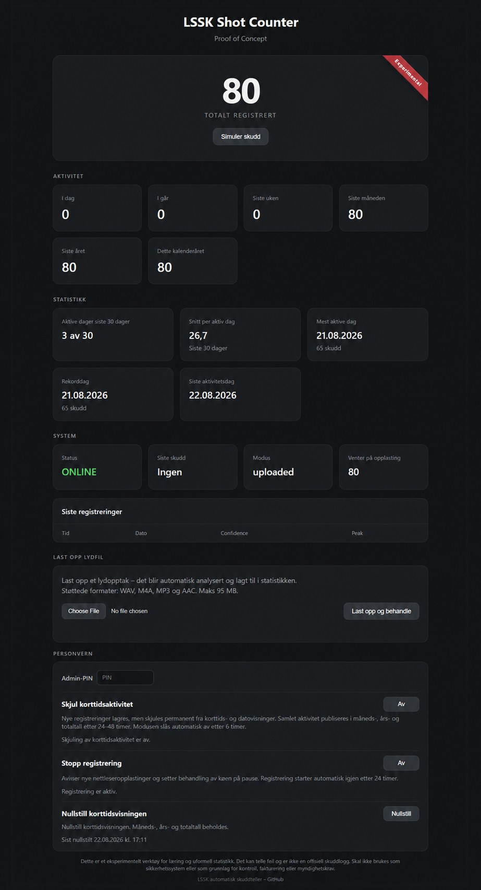

# Shot Counter

An offline-first shot-counting proof of concept for shooting ranges. It accepts uploaded audio recordings, detects impulse-like acoustic events, stores detections in SQLite, and presents activity statistics in a lightweight web dashboard.

> **Project origin:** This project was initially created for [Lofoten Sportsskytterklubb (LSSK)](https://lssk.no/).

## Features

- SQLite is the local source of truth.
- Browser uploads for WAV, M4A, MP3, and AAC recordings.
- FFmpeg normalization to mono 48 kHz WAV before analysis.
- SHA-256 deduplication so the same recording is not counted twice.
- Recording timestamps from embedded metadata, with filesystem time as a fallback.
- Dashboard counters for today, yesterday, the last week, month, and year, plus the current calendar year and total.
- Activity-aware statistics such as active days, average per active day, the recent busiest day, the all-time record day, and the last activity day.
- Configurable English or Norwegian Bokmål dashboard language, with external JSON language packs and English fallback strings.
- PIN-protected privacy controls: short-term suppression, delayed aggregate publication, a 24-hour registration pause, and a manual soft reset.
- Automatic expiry and an amber dashboard state for active privacy controls.
- `robots.txt`, `bots.txt`, and `X-Robots-Tag` responses that ask crawlers not to index the site.
- Example systemd services and Nginx reverse-proxy configuration.
- Offline processing with a documented path toward outbound-only synchronization.

## Dashboard preview

The screenshot shows the current LSSK proof-of-concept deployment, including the experimental marker and privacy controls. The public application uses generic **Shot Counter** branding and configurable range identity.



## Experimental status

The current detector is experimental. It uses short-window audio energy and event clustering; it is not a trained firearm classifier. It must be calibrated and validated with recordings from the intended range, microphone placement, firearms, and background conditions.

Do not use this software as a safety system, an official range log, or the sole basis for compliance, billing, or enforcement decisions.

## Privacy focused

The dashboard includes PIN-protected controls for sessions where publishing immediate activity could reveal more than the range wants to share:

- **Hide short-term activity:** activates privacy mode for up to six hours. New detections are stored, but are permanently excluded from today, yesterday, last-week, recent-registration, last-shot, and other date-specific public views.
- **Delay long-term statistics:** detections made during privacy mode are added to month, year, calendar-year, and total aggregates only after a randomized 24–48 hour delay, making individual sessions harder to infer from counter changes.
- **Pause registration:** rejects new browser uploads and pauses processing of the upload queue for up to 24 hours. Queued recordings remain available for processing after the pause expires or is switched off.
- **Soft reset:** clears the public short-term view without deleting detections or changing month, year, calendar-year, and total aggregates.
- **Automatic expiry and visible state:** privacy mode and registration pause turn themselves off automatically. The System card changes to amber `PERSONVERN` or `PAUSE` and shows the expiry time; if both controls are active, it shows both deadlines.
- **PIN protection:** changing a privacy control or performing a soft reset requires the administrator PIN configured locally in `config.yaml`. No deployment PIN or other secret is included in this repository.

These controls reduce immediate visibility and make activity patterns less precise; they do not provide formal anonymization. The registration pause controls this application's uploads and processing queue, not an independent recorder unless it is integrated with the same state.

## Components

```text
Browser upload or local file transfer
                 |
                 v
       uploads/incoming directory
                 |
                 v
       upload_processor.py
       FFmpeg + event detection
                 |
                 v
              SQLite
                 |
                 v
              app.py
                 |
                 v
          Web dashboard/API
```

- `app.py` provides the Flask dashboard, JSON API, upload endpoint, statistics, and privacy controls.
- `locales/` contains the external dashboard language packs. English (`en`) is the default and Norwegian Bokmål uses `nb`.
- `upload_processor.py` watches for completed audio files, honors registration pauses, normalizes audio, writes detections, and moves originals to `processed/` or `failed/`.
- `config.example.yaml` documents paths, identity, timezone, server settings, and detector parameters.
- `deploy/systemd/` contains service units for Debian-based systems.
- `deploy/nginx/` contains an optional reverse-proxy example.
- [`docs/INSTALL.md`](docs/INSTALL.md) provides the complete installation procedure.
- [`docs/CONNECTIVITY_ARCHITECTURE.md`](docs/CONNECTIVITY_ARCHITECTURE.md) describes offline-first and outbound-only deployment options.

## Installation

For a persistent Debian 13 installation, follow the complete [installation guide](docs/INSTALL.md). It covers the service account, writable data directories, configuration, systemd services, upload testing, Nginx, updates, and troubleshooting.

For a local code-level evaluation:

```bash
git clone https://github.com/G33kM0bile/Shot-counter.git
cd Shot-counter
sudo apt update
sudo apt install python3 python3-venv ffmpeg libsndfile1
python3 -m venv venv
venv/bin/pip install -r requirements.txt
cp config.example.yaml config.yaml
# Edit config.yaml: use writable local paths and set a private admin.pin.
venv/bin/python app.py
```

The example configuration uses system paths intended for the full Debian installation. Change the database, upload, and processing paths before running it as an unprivileged user. Start `venv/bin/python upload_processor.py` in a second terminal if you also want uploaded files to be analyzed.

## Dashboard language

Set the interface language in `config.yaml`:

```yaml
ui:
  language: en
  title: Shot Counter
  footer_label: Automatic shot counter
```

Use `language: nb` for Norwegian Bokmål. To add another language, copy `locales/en.json` to a file named after the new language code, translate its `strings`, set the locale metadata, and select that code under `ui.language`. Missing keys in a selected language pack fall back to English. Restart `shot-counter.service` after changing the language or branding.

## Operating modes

Implemented:

- `uploaded`: process uploaded recordings; the simulation endpoint is disabled unless `detector.allow_simulation` is explicitly enabled for a proof of concept.
- `simulated`: add a test detection every 30 seconds and expose the dashboard's simulation button.

Planned:

- **Automatic recording** *(planned, not implemented)*: capture audio from a locally connected microphone and feed recordings into the same offline processing and statistics pipeline without requiring manual uploads.

Use `simulated` only for an isolated demonstration. Never leave it enabled when collecting real statistics.

## Planned functionality

- **Automatic counting at the range:** use a small Debian PC, a powered USB hub, and multiple USB microphones to capture and analyze range activity without manual uploads. Exact hardware recommendations will be added after real-world testing.
- **Multi-microphone event fusion:** process microphones independently, then cluster matching detections so a shot heard by several microphones is counted once.
- **Offline-first historical synchronization:** keep SQLite as the local source of truth and queue outbound synchronization while offline. When connectivity is available, publish time-series aggregates to InfluxDB for long-term Grafana dashboards without requiring inbound firewall ports.
- **Live counters on the club website:** provide a small read-only feed or embeddable counter for the club's main website, while respecting privacy mode, delayed publication, and registration pauses.
- **Microphone and system health:** report disconnected microphones, stalled capture, queue backlog, disk usage, and the time of the last successful analysis and synchronization.
- **Calibration profiles:** store per-range and per-microphone detector thresholds so changes in placement, firearms, acoustics, and background noise can be tested and reproduced.
- **Rolling audio retention:** keep only a short local recording buffer or detected-event windows, with configurable automatic cleanup to prevent continuous recording from filling the disk.
- **Backup and export:** provide scheduled SQLite backups and simple aggregate-data export for recovery or independent analysis.

## Deployment and security

The included upload endpoint is intentionally simple and has no user authentication. Administrative privacy actions require the PIN configured under `admin.pin`, but this proof-of-concept PIN has no rate limiting and is not a replacement for proper authentication. When `detector.allow_simulation` is enabled, the public simulation button and endpoint can add test detections. `robots.txt` and `bots.txt` are crawler requests, not access controls.

Before exposing an installation publicly:

- put the Flask app behind Nginx, a tunnel, or another managed reverse proxy;
- add authentication or an access gateway to uploads and administrative actions;
- add rate limits and storage quotas;
- review audio retention, because recordings may contain conversations or other sensitive sound;
- keep SQLite, SSH, and the Flask development server off the public internet;
- use TLS for every public connection.

## Known limitations

- The detector may count non-shot impulses and miss quieter shots.
- Different firearms and room acoustics require calibration data.
- A language change requires an application restart; language selection is installation-wide rather than per browser.
- The built-in Flask server is suitable for this proof of concept, but a production deployment should use a hardened WSGI server and authenticated administrative routes.

## Data that must not be committed

Do not add live `config.yaml` files, SQLite databases, audio recordings, access tokens, SSH keys, logs, or host-specific credentials to the repository. The supplied `.gitignore` excludes the common local forms of these files.

## License

This project is available under the permissive [MIT License](LICENSE). Most of the proof-of-concept code was "vibe coded" with OpenAI Codex and ChatGPT, with human direction, review, testing, and deployment.

