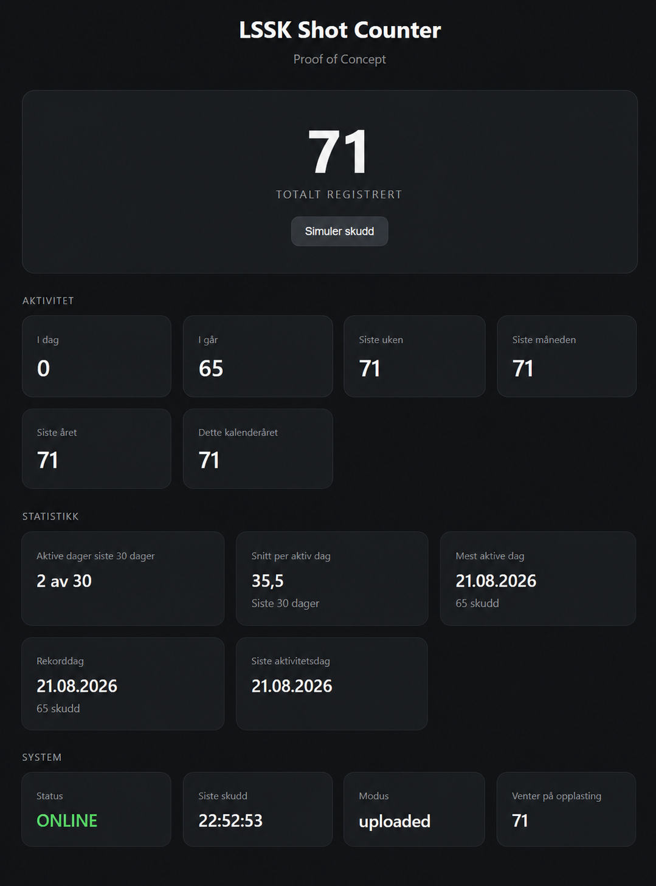

# Shot Counter

An offline-first shot-counting proof of concept for shooting ranges. It accepts uploaded audio recordings, detects impulse-like acoustic events, stores detections in SQLite, and presents activity statistics in a lightweight web dashboard.

> **Project origin:** This project was initially created for [Lofoten Sportsskytterklubb (LSSK)](https://lssk.no/).

## Dashboard preview



## Important status

The current detector is experimental. It uses short-window audio energy and event clustering; it is not a trained firearm classifier. It must be calibrated and validated with recordings from the intended range, microphone placement, firearms, and background conditions.

Do not use this software as a safety system, an official range log, or the sole basis for compliance, billing, or enforcement decisions.

## Privacy focused

The dashboard includes PIN-protected controls for sessions where publishing immediate activity could reveal more than the range wants to share:

- **Hide short-term activity:** activates privacy mode for up to six hours. New detections are stored, but are permanently excluded from today, yesterday, last-week, recent-registration, last-shot, and other date-specific public views.
- **Delay long-term statistics:** detections made during privacy mode are added to month, year, calendar-year, and total aggregates only after a randomized 24–48 hour delay, making individual sessions harder to infer from counter changes.
- **Pause registration:** rejects new browser uploads and pauses processing of the upload queue for up to 24 hours. Queued recordings remain available for processing after the pause expires or is switched off.
- **Soft reset:** clears the public short-term view without deleting detections or changing month, year, calendar-year, and total aggregates.
- **Automatic expiry and visible state:** privacy mode and registration pause turn themselves off automatically. The System card changes to amber `PERSONVERN` or `PAUSE` and shows the expiry time; if both controls are active, it shows both deadlines.
- **PIN protection:** changing a privacy control or performing a soft reset requires the administrator PIN configured locally in `config.yaml`. No deployment PIN or other secret is included in this repository.

These controls reduce immediate visibility and make activity patterns less precise; they do not provide formal anonymization. The registration pause controls this application's uploads and processing queue, not an independent recorder unless it is integrated with the same state.

## Features

- SQLite is the local source of truth.
- Browser uploads for WAV, M4A, MP3, and AAC recordings.
- FFmpeg normalization to mono 48 kHz WAV before analysis.
- SHA-256 deduplication so the same recording is not counted twice.
- Recording timestamps from embedded metadata, with filesystem time as a fallback.
- Dashboard counters for today, yesterday, the last week, month, and year, plus the current calendar year and total.
- Activity-aware statistics such as active days, average per active day, the recent busiest day, the all-time record day, and the last activity day.
- PIN-protected privacy controls: short-term suppression, delayed aggregate publication, a 24-hour registration pause, and a manual soft reset.
- `robots.txt`, `bots.txt`, and `X-Robots-Tag` responses that ask crawlers not to index the site.
- Example systemd services and Nginx reverse-proxy configuration.
- Offline processing with a documented path toward outbound-only synchronization.

## Components

```text
Browser upload or local file transfer
                 |
                 v
       uploads/incoming directory
                 |
                 v
       upload_processor.py
       FFmpeg + event detection
                 |
                 v
              SQLite
                 |
                 v
              app.py
                 |
                 v
          Web dashboard/API
```

- `app.py` provides the Flask dashboard, JSON API, upload endpoint, statistics, and privacy controls.
- `upload_processor.py` watches for completed audio files, honors registration pauses, normalizes audio, writes detections, and moves originals to `processed/` or `failed/`.
- `config.example.yaml` documents paths, identity, timezone, server settings, and detector parameters.
- `deploy/systemd/` contains service units for Debian-based systems.
- `deploy/nginx/` contains an optional reverse-proxy example.
- [`docs/INSTALL.md`](docs/INSTALL.md) provides the complete installation procedure.
- [`docs/CONNECTIVITY_ARCHITECTURE.md`](docs/CONNECTIVITY_ARCHITECTURE.md) describes offline-first and outbound-only deployment options.

## Quick start

For Debian 13, follow the [installation guide](docs/INSTALL.md). The short version is:

```bash
sudo apt install python3 python3-venv ffmpeg libsndfile1
python3 -m venv venv
venv/bin/pip install -r requirements.txt
cp config.example.yaml config.yaml
venv/bin/python app.py
```

Edit `config.yaml` before starting either component so its database and upload directories exist and are writable. Set a private value for `admin.pin`; the example PIN is not intended for deployment. The sample uses system paths intended for the full Debian installation, not an unprivileged checkout.

## Operating modes

- `uploaded`: process uploaded recordings; the simulation endpoint is disabled.
- `simulated`: add a test detection every 30 seconds and expose the dashboard's simulation button.
- **Automatic recording** *(planned, not implemented)*: capture audio from a locally connected microphone and feed recordings into the same offline processing and statistics pipeline without requiring manual uploads.

Use `simulated` only for an isolated demonstration. Never leave it enabled when collecting real statistics.

## Security and privacy

The included upload endpoint is intentionally simple and has no user authentication. Administrative privacy actions require the PIN configured under `admin.pin`, but this proof-of-concept PIN has no rate limiting and is not a replacement for proper authentication. `robots.txt` and `bots.txt` are crawler requests, not access controls.

Privacy mode stores detections immediately, permanently removes them from short-term and date-specific public views, and delays their inclusion in aggregate month, year, and total counters. Registration pause rejects browser uploads and defers the processor queue; it does not control an independent external recorder unless that recorder is integrated with the same state.

Before exposing an installation publicly:

- put the Flask app behind Nginx, a tunnel, or another managed reverse proxy;
- add authentication or an access gateway to uploads and administrative actions;
- add rate limits and storage quotas;
- review audio retention, because recordings may contain conversations or other sensitive sound;
- keep SQLite, SSH, and the Flask development server off the public internet;
- use TLS for every public connection.

## Known limitations

- The detector may count non-shot impulses and miss quieter shots.
- Different firearms and room acoustics require calibration data.
- The application currently embeds the Norwegian dashboard template in `app.py`.
- The built-in Flask server is suitable for this proof of concept, but a production deployment should use a hardened WSGI server and authenticated administrative routes.

## Data that must not be committed

Do not add live `config.yaml` files, SQLite databases, audio recordings, access tokens, SSH keys, logs, or host-specific credentials to the repository. The supplied `.gitignore` excludes the common local forms of these files.

